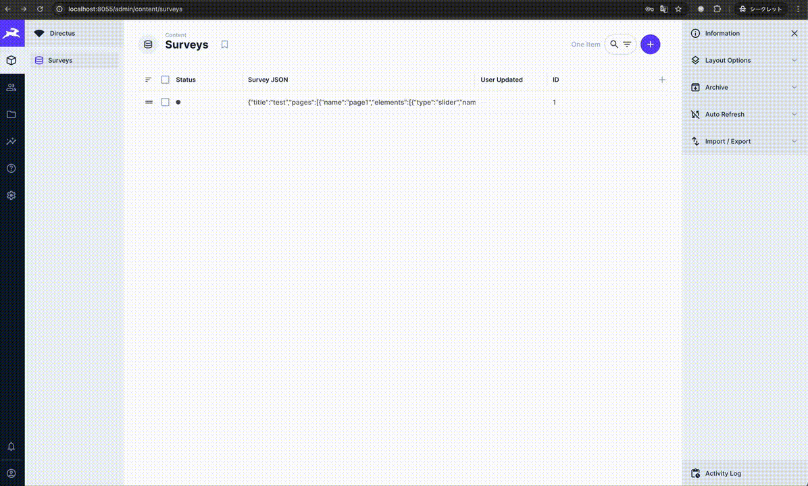
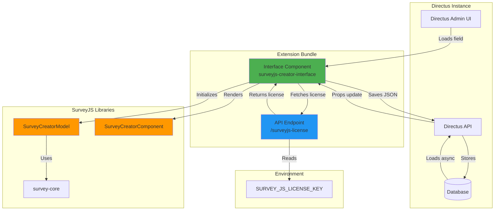

# Directus SurveyJS Creator Extension


[](https://opensource.org/licenses/MIT)

A Directus bundle extension that integrates [SurveyJS Creator](https://surveyjs.io/survey-creator) as a custom interface, allowing you to visually design surveys within Directus and store survey definitions as JSON.



## Features

- **Visual Survey Designer**: Use SurveyJS Creator's intuitive drag-and-drop interface within Directus
- **JSON Storage**: Save survey definitions as JSON in Directus collections

## Requirements

- Directus 11.0.0 or later
- Node.js 22.x or later
- npm or yarn

## Installation

### From GitHub Packages

1. Create a `.npmrc` file in your project root:

```bash
@dulltz:registry=https://npm.pkg.github.com
//npm.pkg.github.com/:_authToken=${GITHUB_TOKEN}
```

2. Set your GitHub personal access token (requires `read:packages` permission):

```bash
export GITHUB_TOKEN=your_github_token_here
```

3. Install the package:

```bash
npm install @dulltz/directus-surveyjs-creator
```

### From Source

```bash
cd your-directus-project/extensions
git clone https://github.com/dulltz/directus-surveyjs-creator.git
cd directus-surveyjs-creator
npm install
npm run build
```

## Configuration

### License Key

Set the environment variable in your Directus instance:

```bash
SURVEY_JS_LICENSE_KEY=your-license-key-here
```

The extension automatically serves the license key via the `/surveyjs-license` endpoint.

### Field Setup

1. Go to **Settings** > **Data Model** in Directus
2. Create or edit a collection
3. Add a new field with type **Code** or **JSON**
4. Select **SurveyJS Creator** as the interface
5. Save the field configuration

## Usage

1. Navigate to your collection
2. Create a new item or edit an existing one
3. Use the SurveyJS Creator interface to design your survey
4. The survey JSON is automatically saved to the field

## Architecture

This extension is a **bundle extension** containing:

1. **Interface Component** (`surveyjs-creator-interface`): Vue 3 component that renders SurveyJS Creator
2. **API Endpoint** (`surveyjs-license`): Serves the SurveyJS license key from environment variables



### Component Lifecycle

The extension implements a sophisticated lifecycle management strategy to handle Directus's asynchronous props loading:

1. **Component Mount**: Interface fetches license key and initializes Creator (uses default survey if no data exists)
2. **Async Data Loading**: Directus loads field data from database, triggering re-initialization with saved data
3. **User Interaction**: User designs survey using SurveyJS Creator interface
4. **Save**: JSON is extracted and saved to Directus via API
5. **Component Unmount**: Cleanup to prevent memory leaks

For detailed technical documentation, see [LIFECYCLE_CONFLICT_RESOLUTION.md](./LIFECYCLE_CONFLICT_RESOLUTION.md).

## Development

```bash
# Install dependencies
npm install

# Start development mode with hot reload
npm run dev

# Run tests
npm test

# Build for production
npm run build

# Validate extension structure
npm run validate
```

### Local Development with Docker

```bash
export SURVEY_JS_LICENSE_KEY="optional-license-key"
docker-compose up -d
```

Access Directus at http://localhost:8055:
- Email: admin@example.com
- Password: admin

## Troubleshooting

### Extension not appearing in Directus

1. Ensure the extension is built: `npm run build`
2. Check that `dist/` directory exists with `app.js` and `api.js`
3. Verify Directus is running version 11.0.0 or later

### Survey JSON not saving

1. Verify the field type is `code` or `json`
2. Check browser console for errors
3. Ensure the extension is properly built and loaded

## License

MIT License - see [LICENSE](LICENSE) file for details

## Links

- [Directus Extensions Documentation](https://docs.directus.io/extensions/)
- [SurveyJS Creator Documentation](https://surveyjs.io/survey-creator/documentation/overview)
- [Vue 3 Documentation](https://vuejs.org/)
