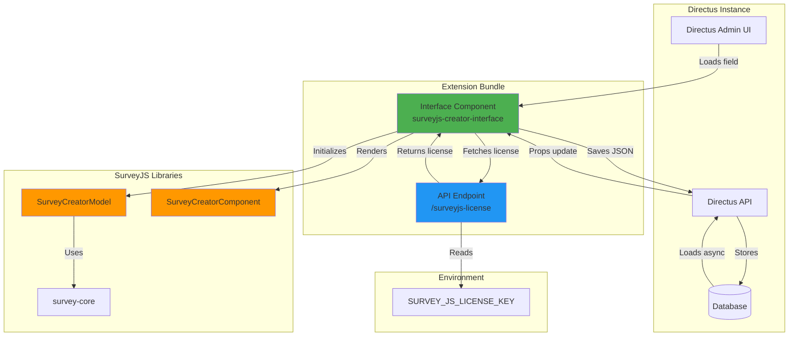

# Directus SurveyJS Creator Extension


[](https://opensource.org/licenses/MIT)

A Directus bundle extension that integrates [SurveyJS Creator](https://surveyjs.io/survey-creator) as a custom interface, allowing you to visually design surveys within Directus and store survey definitions as JSON.

## Features

- **Visual Survey Designer**: Use SurveyJS Creator's intuitive drag-and-drop interface within Directus
- **JSON Storage**: Save survey definitions as JSON in Directus collections
- **License Key Management**: Securely serve SurveyJS license keys via environment variables
- **Directus 11 Compatible**: Built for the latest Directus version
- **TypeScript**: Fully typed with Vue 3 Composition API
- **Test Coverage**: Comprehensive test suite with Vitest

## Installation

### Prerequisites

- Directus 11.0.0 or later
- Node.js 22.x or later
- npm or yarn

### Install from GitHub Packages

1. Create a `.npmrc` file in your project root (or copy `.npmrc.example`):

```bash
@dulltz:registry=https://npm.pkg.github.com
//npm.pkg.github.com/:_authToken=${GITHUB_TOKEN}
```

2. Set your GitHub personal access token:

```bash
export GITHUB_TOKEN=your_github_token_here
```

3. Install the package:

```bash
npm install @dulltz/directus-surveyjs-creator
```

**Note**: You need a GitHub personal access token with `read:packages` permission. Create one at: https://github.com/settings/tokens

### Install from Source

Or add directly to your Directus extensions directory:

```bash
cd your-directus-project/extensions
git clone https://github.com/dulltz/directus-surveyjs-creator.git
cd directus-surveyjs-creator
npm install
npm run build
```

### Docker Compose Setup

This extension includes a Docker Compose configuration for local development:

```bash
# Set your SurveyJS license key (optional)
export SURVEY_JS_LICENSE_KEY="your-license-key"

# Start Directus with the extension
docker-compose up -d

# View logs
docker-compose logs -f directus
```

Access Directus at http://localhost:8055:
- Email: admin@example.com
- Password: admin

## Configuration

### License Key

To use SurveyJS Creator with a license key:

1. Set the environment variable in your Directus instance: `SURVEY_JS_LICENSE_KEY=your-license-key-here`

2. The extension automatically serves the license key via the `/surveyjs-license` endpoint

### Field Setup

1. Go to **Settings** > **Data Model** in Directus
2. Create or edit a collection
3. Add a new field with type **Code** or **JSON**
4. Select **SurveyJS Creator** as the interface
5. Save the field configuration

## Usage

### Creating a Survey

1. Navigate to your collection
2. Create a new item or edit an existing one
3. Use the SurveyJS Creator interface to design your survey
4. The survey JSON is automatically saved to the field

### Survey Definition Format

The extension stores survey definitions in standard SurveyJS JSON format:

```json
{
  "title": "My Survey",
  "pages": [
    {
      "name": "page1",
      "elements": [
        {
          "type": "text",
          "name": "question1",
          "title": "What is your name?"
        }
      ]
    }
  ]
}
```

## Development

### Setup

```bash
# Install dependencies
npm install

# Start development mode with hot reload
npm run dev

# Run tests
npm test

# Run tests with UI
npm run test:ui

# Generate coverage report
npm run test:coverage

# Build for production
npm run build

# Build and restart Directus (for Docker Compose development)
npm run build:reload

# Validate extension structure
npm run validate
```

### Architecture

This extension is a **bundle extension** containing:

1. **Interface Component** (`surveyjs-creator-interface`): Vue 3 component that renders SurveyJS Creator
2. **API Endpoint** (`surveyjs-license`): Serves the SurveyJS license key from environment variables



#### Component Interaction Flow

1. **Component Mount (`onMounted`)**
   - Directus Admin UI mounts Interface Component
   - `props.value` may be `null` initially (Directus loads data asynchronously)
   - Interface fetches license key from `/surveyjs-license` endpoint
   - Calls `initializeCreator()` immediately (uses `defaultSurvey` if props.value is null)
   - Sets up one-time watch to monitor `props.value` changes
   - Starts 100ms timeout fallback for null props

2. **Async Data Loading (Existing Items)**
   - Directus API loads field data from database (50-200ms after mount)
   - `props.value` updates from `null` to actual survey JSON
   - Watch detects non-null value and triggers force re-initialization
   - Watch stops itself (`stopWatch()`) to prevent memory issues
   - Creator now displays saved survey data

3. **New Item Creation**
   - `props.value` remains `null` (no existing data)
   - Timeout (100ms) fires, checks `initialLoadComplete` flag
   - If not initialized, uses `defaultSurvey` to initialize Creator
   - User can immediately start designing survey

4. **User Interaction & Save**
   - User designs survey using SurveyJS Creator interface
   - On save button click, `saveSurveyFunc` is called
   - JSON is extracted from `creator.JSON`
   - Emits `@input` event with JSON string
   - Directus API saves to database field

5. **Component Unmount (`onUnmounted`)**
   - Sets `isMounted = false` to prevent operations
   - Cleans up creator instance (`creator.value = null`)
   - Prevents memory leaks

### Lifecycle Management

The extension implements a sophisticated lifecycle management strategy to handle Directus's asynchronous props loading:

- **One-time watch**: Monitors `props.value` changes and stops after initial load
- **Timeout fallback**: Ensures initialization even when creating new items (props.value = null)
- **Force re-initialization**: Handles late-arriving data from Directus

For detailed technical documentation, see [LIFECYCLE_CONFLICT_RESOLUTION.md](./LIFECYCLE_CONFLICT_RESOLUTION.md).

## Testing

The project uses Vitest with Vue Test Utils for comprehensive testing:

```bash
# Run all tests
npm test

# Watch mode for TDD
npm run test:watch

# Visual test UI
npm run test:ui

# Coverage report
npm run test:coverage
```

## Technical Details

### Bundle Size

- `app.js`: ~3.2MB (includes SurveyJS Creator libraries)
- `api.js`: ~48KB (license key endpoint)

### Dependencies

- `survey-core`: ^2.3.15
- `survey-creator-core`: ^2.3.15
- `survey-creator-vue`: ^2.3.15

### Development Dependencies

- `@directus/extensions-sdk`: 17.0.2
- `vitest`: ^4.0.8
- `@vue/test-utils`: ^2.4.6
- `typescript`: ^5.9.3

## Troubleshooting

### Extension not appearing in Directus

1. Ensure the extension is built: `npm run build`
2. Check that `dist/` directory exists with `app.js` and `api.js`
3. Verify Directus is running version 11.0.0 or later
4. Enable `EXTENSIONS_AUTO_RELOAD=true` in your Directus environment

### Browser crashes or freezes

This was a known issue during development, resolved by implementing the one-time watch pattern. If you experience crashes:

1. Clear browser cache
2. Ensure you're using the latest version of the extension
3. Check browser console for errors

### Survey JSON not reflecting after save

This issue has been resolved. The extension now properly handles Directus's asynchronous data loading. If you still experience this:

1. Check browser console for errors
2. Verify the field type is `code` or `json`
3. Ensure the extension is properly built and loaded

## Publishing

### Publishing to GitHub Packages

The package is automatically published to GitHub Packages when you push a version tag.

**Automatic publish via tag**:
```bash
# Update version in package.json (optional, tag will override it)
npm version patch  # or minor, major

# Create and push tag
git tag v1.0.1
git push origin v1.0.1

# GitHub Actions will automatically:
# 1. Extract version from tag (v1.0.1 → 1.0.1)
# 2. Update package.json version
# 3. Run tests and build
# 4. Publish to GitHub Packages
```

**Manual publish**:
```bash
npm run build
npm publish
```

**Using GitHub Actions manually**:
1. Go to Actions tab → Publish to GitHub Packages
2. Click "Run workflow"
3. Optionally specify a version number
4. The workflow will test, build, and publish

## License

MIT License - see [LICENSE](LICENSE) file for details

## Links

- [Directus Extensions Documentation](https://docs.directus.io/extensions/)
- [SurveyJS Creator Documentation](https://surveyjs.io/survey-creator/documentation/overview)
- [Vue 3 Documentation](https://vuejs.org/)
